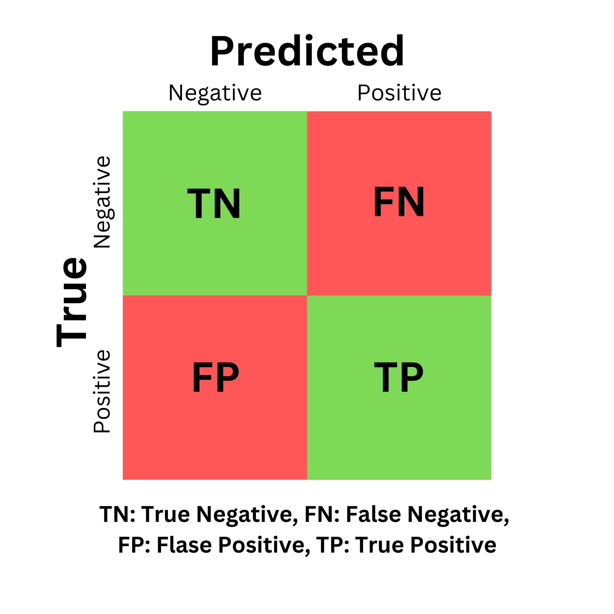

# Image + Text Pair Classification

### Overview of Task

Though images are often used (for better, or for worse) in articles or social media posts, incorporating them to the bias or fake news classification pipeline is still relatively unexplored in research.&#x20;

Image/text pair classification relies on the same type of text embeddings used in [sequence classification](../sequence-classification/binary.md) and [NER](../ner/token-classification.md) (created by a text encoder like [BERT](https://huggingface.co/docs/transformers/en/model\_doc/bert)). This time, we also process images with an image encoder, then fuse the text and image encodings together, for classification tasks such as binary classification.

<figure><figcaption></figcaption></figure>

***

### 🤖 Models:&#x20;



## TruBIAS

Coming soon ;)



### BERT + ResNet34 (guided by CLIP)

To preform the encoding required for both text and images, we can use pre-trained encoders for each, then use a classification head to classify the combined outputs (with concatenation, alignment, contrast, etc). The same text encoders from other tasks will work (usually [BERT](https://huggingface.co/docs/transformers/en/model\_doc/bert)-based), and [ResNet34](https://pytorch.org/vision/main/models/generated/torchvision.models.resnet34.html) is common in literature (though other image encoders will also work). They'll preform feature extraction on both the text and images, to be fed into a classification head.

Aligning (or combining) the embeddings can be very sensitive. There are many methods and you're free to create your own, but concatenation tends to be the most reliable. Still, the raw embeddings will be on different scales (normalization helps).&#x20;

An interesting approach is to also use a framework that's been trained on both text AND images, like [CLIP](https://openai.com/index/clip/), which have representations in the same embedding space. We can process the text/image pairs with BERT and ResNet34, alongside CLIP, to calculate a contrastive loss (how different they are). When combined with the classification loss of the output head, this can guide the two specialized encoders towards a shared embedding space during fine-tuning.

#### 📄 Research Paper



#### 💻 Notebook to Train Your Own





Coming soon



Still lookin'



### 💾 Datasets:



### **News Media Bias Plus (NMB+) Dataset**

90k rows | 2024

The dataset includes around 90,000 news articles, curated from a broad spectrum of [reliable](https://www.allsides.com/media-bias) [sources](https://today.yougov.com/politics/articles/49552-trust-in-media-2024-which-news-outlets-americans-trust), including major news outlets from around the globe, from May 2023 to September 2024. These articles were gathered through open data sources using Google RSS, adhering to research ethics guidelines.&#x20;

NMB+ has images, and multi-modal labels for the text + image pair of each news article.

#### 📑 Contents

<table><thead><tr><th width="226">Field</th><th>Description</th></tr></thead><tbody><tr><td><strong><code>unique_id</code></strong></td><td>Unique identifier for each news item. <strong>Each <code>unique_id</code> is associated with the image (top image) for the same news article.</strong></td></tr><tr><td><strong><code>outlet</code></strong></td><td>Publisher of the news article.</td></tr><tr><td><strong><code>headline</code></strong></td><td>Headline of the news article.</td></tr><tr><td><strong><code>article_text</code></strong></td><td>Full text content of the news article.</td></tr><tr><td><strong><code>image_description</code></strong></td><td>Description of the image paired with the article.</td></tr><tr><td><strong><code>image</code></strong></td><td>File path of the image associated with the article.</td></tr><tr><td><strong><code>date_published</code></strong></td><td>Publication date of the news article.</td></tr><tr><td><strong><code>source_url</code></strong></td><td>Original URL of the news article.</td></tr><tr><td><strong><code>canonical_link</code></strong></td><td>Canonical URL of the news article, if different from the source URL.</td></tr><tr><td><strong><code>new_categories</code></strong></td><td>Categories assigned to the article.</td></tr><tr><td><strong><code>news_categories_confidence_scores</code></strong></td><td>Confidence scores for the assigned categories.</td></tr><tr><td><strong><code>text_label</code></strong></td><td>
Annotation for the textual content, indicating:

<code>'Likely'</code>or <code>'Unlikely'</code>to be disinformation.
</td></tr><tr><td><strong><code>multimodal_label</code></strong></td><td>
Annotation for the combined text snippet (first paragraph of the news story) and image content, assessing:

<code>'Likely'</code>or <code>'Unlikely'</code>to be disinformation.
</td></tr></tbody></table>

#### 🤗HuggingFace Dataset (Request access)



#### Website (Official Docs)



#### 📰 Blog Post





***


Fine-tune Llama 3.2 Vision Instruct QLORA for image/text classification:[ 💻Notebook](https://github.com/VectorInstitute/news-media-bias-plus/blob/main/benchmarking/multi-modal-classifiers/baselines-and-notebooks/training-notebooks/llm/llama\_3\_2\_vision\_finetune.ipynb)



Train your own VLM for bias detection: [💻(4) Notebooks](https://github.com/VectorInstitute/news-media-bias-plus/tree/main/benchmarking/multi-modal-classifiers/baselines-and-notebooks/training-notebooks/slm)


### How it Works:

1. BERT (or other text encoder models) <mark style="background-color:yellow;">processes a text sequence into a encoding sequence,</mark> where self-attention heads encode the contextual words' meaning into each token representation.&#x20;
2. ResNet (or other image encoder models) processes an image into a convolutional representation.
3. We combine/pool the text and image representations into <mark style="background-color:yellow;">one set of features that we can classify</mark>. There are many techniques, such as:
   1. **Concatenation**: Plugging the representations together, one after another.
   2. **Dot product alignment**: Using the dot product of the representations as the representation.
   3. **Fusion layer**: a linear layer(s) to process the representations before classification.
4. The aligned embeddings are passed into a classification head, with an output logit, that is activated (typically with a sigmoid or softmax function), for a probability that falls between 0-1.
5. A threshold is sometimes applied to the output (e.g. probability > 0.5 is "Biased").

Metrics:

When evaluating models' performance at binary classification, you should try to understand the way positive (biased), negative (neutral) fall into the categories: correct (true) predictions, and incorrect (false) predictions.

Your individual requirements will guide your interpretation (e.g. maybe you REALLY want to avoid false positives).

*   **Confusion Matrix**: Used to visualize the levels of correct and incorrect classifications made, the goal&#x20;

    <figure><figcaption></figcaption></figure>
* **Precision**: $$\frac{TP}{TP + FP}$$
* **Recall**: $$\frac{TP}{TP + FN}$$
* **F1 Score**: $$2 \times \frac{precision \times recall}{precision + recall}$$

***

