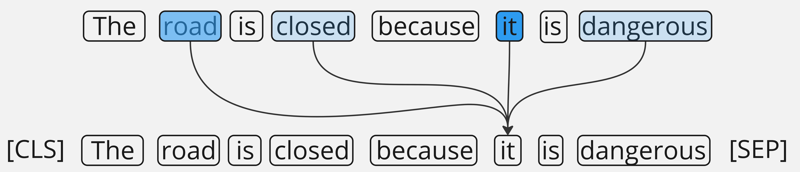

# Token Classification

### Overview of Task:

Named-entity recognition (NER) is a cornerstone of NLP tools. NER enables token-level label classification (i.e. of words or subwords).

In the context of bias classification, this could be used to identify the "biased words" in a text sequence, offering a different view and granularity than sequence level classification.&#x20;

Similarly to sequence classification tasks, we can finetune pre-trained NLP models like [BERT](https://huggingface.co/docs/transformers/en/model\_doc/bert) to preform token classification. BERT processes the text sequence to create contextual representations for each token. Then, instead of pooling the representations and making a classification on the whole sentence, we make a classification of each token's representation. This can be done with the same type of classification head and activation functions, for multi-class or multi-label labels.

<figure><figcaption></figcaption></figure>

_**Note**: NER formatting commonly follows B/I/O format (i.e. Beginning, Inside, Outside) to describe the boundaries of an entity. Entities may span multiple tokens, so we use B- tags for the beginning of the entity, and I- tags for consecutive tokens inside of the entity._&#x20;

### 🤖 Models:



### UnBIAS NER

Similar to how UnBIAS's classifier was a refresh of the Dbias architecture, UnBIAS NER is a refresh of another prominent paper: Nbias. Both UnBIAS and Nbias allow for word-level label prediction of bias, enabling deeper insights into which words might be contributing the most to bias classifications.

**Base Model**: `bert-base-uncased` Dataset: [BEADs](https://huggingface.co/datasets/shainar/BEAD) (3.67M rows)

#### **🤗H**ugging Face Model




#### **📄** Research Paper



#### Use UnBIAS NER:

```python
# pip install transformers
from transformers import AutoModelForTokenClassification, AutoTokenizer
import torch

device = torch.device("cpu")

# Load model directly
from transformers import AutoTokenizer, AutoModelForTokenClassification

tokenizer = AutoTokenizer.from_pretrained("newsmediabias/UnBIAS-NER")
model = AutoModelForTokenClassification.from_pretrained("newsmediabias/UnBIAS-NER")

def highlight_biased_entities(sentence):
    tokens = tokenizer.tokenize(tokenizer.decode(tokenizer.encode(sentence)))
    inputs = tokenizer.encode(sentence, return_tensors="pt")
    inputs = inputs.to(device)

    outputs = model(inputs).logits
    predictions = torch.argmax(outputs, dim=2)

    id2label = model.config.id2label

    # Reconstruct words from subword tokens and highlight them
    highlighted_sentence = ""
    current_word = ""
    is_biased = False
    for token, prediction in zip(tokens, predictions[0]):
        label = id2label[prediction.item()]
        if label in ['B-BIAS', 'I-BIAS']:
            if token.startswith('##'):
                current_word += token[2:]
            else:
                if current_word:
                    if is_biased:
                        highlighted_sentence += f"BIAS[{current_word}] "
                    else:
                        highlighted_sentence += f"{current_word} "
                    current_word = token
                else:
                    current_word = token
                is_biased = True
        else:
            if current_word:
                if is_biased:
                    highlighted_sentence += f"BIAS[{current_word}] "
                else:
                    highlighted_sentence += f"{current_word} "
                current_word = ""
            highlighted_sentence += f"{token} "
            is_biased = False
    if current_word:
        if is_biased:
            highlighted_sentence += f"BIAS[{current_word}]"
        else:
            highlighted_sentence += current_word

    # Filter out special tokens and subword tokens
    highlighted_sentence = highlighted_sentence.replace(' [', '[').replace(' ]', ']').replace(' ##', '')

    return highlighted_sentence

sentence = "due to your evil and dishonest nature, i am kind of tired and want to get rid of such cheapters. all people like you are evil and a disgrace to society and I must say to get rid of immigrants as they are filthy to culture"
highlighted_sentence = highlight_biased_entities(sentence)
print(highlighted_sentence)

```



### Generalizations, Unfairness, and Stereotypes Network (GUS-Net)

GUS-Net was proposed to identify the elements of socially biased sentence structures, rather than approaching it with an objective definition of social bias. The proposed entities are: generalizations, unfairness, and stereotypes.

As documented in the [GUS-Net paper](https://arxiv.org/abs/2410.08388), the model was trained on a fully synthetic dataset, intended to contain examples of social bias, which was annotated by agents of each specific entity. The model is multi-label, meaning that a token can be labeled as more than one entity at a time (enabling nested and overlapping entities). The use of focal loss during training was crucial to the performance of GUS-Net, due to the inherent entity imbalances in the [GUS dataset](https://huggingface.co/datasets/ethical-spectacle/gus-dataset-v1).

**Base Model**: `bert-base-uncased` Dataset: [GUS Dataset](https://huggingface.co/datasets/ethical-spectacle/gus-dataset-v1) (3.7k rows)

#### **🤗 H**ugging Face Model



#### **📄** Research Paper



#### Use GUS-Net:

```python
# pip install transformers
import json
import torch
from transformers import BertTokenizerFast, BertForTokenClassification
import gradio as gr

# init important things
tokenizer = BertTokenizerFast.from_pretrained('bert-base-uncased')
model = BertForTokenClassification.from_pretrained('ethical-spectacle/social-bias-ner')
model.eval()
model.to('cuda' if torch.cuda.is_available() else 'cpu')

# ids to labels we want to display
id2label = {
    0: 'O',
    1: 'B-STEREO',
    2: 'I-STEREO',
    3: 'B-GEN',
    4: 'I-GEN',
    5: 'B-UNFAIR',
    6: 'I-UNFAIR'
}

# predict function you'll want to use if using in your own code
def predict_ner_tags(sentence):
    inputs = tokenizer(sentence, return_tensors="pt", padding=True, truncation=True, max_length=128)
    input_ids = inputs['input_ids'].to(model.device)
    attention_mask = inputs['attention_mask'].to(model.device)

    with torch.no_grad():
        outputs = model(input_ids=input_ids, attention_mask=attention_mask)
        logits = outputs.logits
        probabilities = torch.sigmoid(logits)
        predicted_labels = (probabilities > 0.5).int() # remember to try your own threshold

    result = []
    tokens = tokenizer.convert_ids_to_tokens(input_ids[0])
    for i, token in enumerate(tokens):
        if token not in tokenizer.all_special_tokens:
            label_indices = (predicted_labels[0][i] == 1).nonzero(as_tuple=False).squeeze(-1)
            labels = [id2label[idx.item()] for idx in label_indices] if label_indices.numel() > 0 else ['O']
            result.append({"token": token, "labels": labels})

    return json.dumps(result, indent=4)

```




UnBIAS NER (fine-tuned RoBERTa instead of BERT)





### 💾 Datasets:



### **Bias Evaluation Across Domains (BEADs) Dataset**

3.67M rows | 2024

The BEADs corpus was gathered from the datasets: [MBIC](https://zenodo.org/records/4474336), [Hyperpartisan news](https://huggingface.co/datasets/SemEvalWorkshop/hyperpartisan\_news\_detection), [Toxic comment classification](https://www.kaggle.com/competitions/jigsaw-toxic-comment-classification-challenge), [Jigsaw Unintended Bias](https://www.kaggle.com/competitions/jigsaw-unintended-bias-in-toxicity-classification), [Age Bias](https://dataverse.harvard.edu/dataset.xhtml?persistentId=doi:10.7910/DVN/L4OAKN), [Multi-dimensional news (Ukraine)](https://zenodo.org/records/3885351#.ZF0KoxHMLtV), [Social biases](https://maartensap.com/social-bias-frames/).&#x20;

It was annotated by humans, then with semi-supervised learning, and finally human verified.

It's one of the largest and most up-to-date datasets for bias and toxicity classification, though it's currently private so you'll need to request access through HuggingFace.

**🤗Hugging Face Dataset (request access)**



**📑 Contents**

<table><thead><tr><th width="217">Fields</th><th>Description</th></tr></thead><tbody><tr><td><strong><code>text</code></strong></td><td>The sentence or sentence fragment.</td></tr><tr><td><strong><code>dimension</code></strong></td><td>Descriptive category of the text.</td></tr><tr><td><strong><code>biased_words</code></strong></td><td>A compilation of words regarded as biased.</td></tr><tr><td><strong><code>aspect</code></strong></td><td>Specific sub-topic within the main content.</td></tr><tr><td><strong><code>label</code></strong></td><td>Indicates the presence (True) or absence (False) of bias. The label is ternary - highly biased, slightly biased, and neutral.</td></tr><tr><td><strong><code>toxicity</code></strong></td><td>Indicates the presence (True) or absence (False) of toxicity.</td></tr><tr><td><strong><code>identity_mention</code></strong></td><td>Mention of any identity based on words match.</td></tr></tbody></table>

_While BEADs doesn't have a binary label for bias, the ternary labels (e.g. neutral, slightly biased, and highly biased) of the label field can categorized into biased (1), or unbiased (0). Additionally, the toxicity field contains binary labels._

**📄 Research Paper**



<figure><figcaption></figcaption></figure>



### Generalizations, Unfairness, and Stereotypes Dataset

&#x20;3.7k rows | 2024

The GUS dataset (released in the [GUS-Net paper](https://arxiv.org/abs/2410.08388)), is an entirely synthetic dataset. The synthetic corpus was generated by Mistral 7B, and a random sample was labeled by GPT-4o (with a DSPy annotation pipeline) for multi-label token classification of the entities: Generalizations, Unfairness, and Stereotypes.&#x20;

The underlying corpus is 37.5k rows, and contains multi-label type-of-bias (or aspect of bias) labels for each biased text sequence.

#### 🤗Hugging Face Datasets





#### **📑 Contents**

<table><thead><tr><th width="202">Field</th><th>Description</th></tr></thead><tbody><tr><td><strong><code>text_str</code></strong></td><td>The full text fragment where bias is detected.</td></tr><tr><td><strong><code>ner_tags</code></strong></td><td>Binary label, presence (1) or absence (0) of racial bias.</td></tr><tr><td><strong><code>rationale</code></strong></td><td>Binary label, presence (1) or absence (0) of religious bias.</td></tr></tbody></table>

**📄 Research Paper**



#### 📊 Dataset Details (from the paper)

<figure><figcaption></figcaption></figure>

<div align="center">

<figure><figcaption><p>The GUS dataset is a random sample of the corpus (3739 rows), but this chart should also represent the distribution in the corpus</p></figcaption></figure>

</div>



### Bias Annotations By Experts (BABE)

4.12k records | 2023

Human annotated, and all annotators must agree. In its paper, BABE showed great results with BERT for sequence classification of news articles. While smaller than some other datasets, the annotations are very reliable (highly recommended as an external dataset for model eval).

The dataset includes word-level annotations for bias, which can be used for named-entity recognition training.

**🤗HuggingFace Dataset**



**📑 Contents**

<table><thead><tr><th width="187">Fields</th><th>Description</th></tr></thead><tbody><tr><td><strong><code>text</code></strong></td><td>The text fragment (few sentences or less).</td></tr><tr><td><strong><code>outlet</code></strong></td><td>The source of the text fragments.</td></tr><tr><td><strong><code>label</code></strong></td><td>0 or 1 (biased or unbiased).</td></tr><tr><td><strong><code>topic</code></strong></td><td>The subject of the text fragment.</td></tr><tr><td><strong><code>news_link</code></strong></td><td>URL to the original source.</td></tr><tr><td><strong><code>biased_words</code></strong></td><td>Full words contributing to bias, in a list.</td></tr><tr><td><strong><code>type</code></strong></td><td>Political sentiment (if applicable).</td></tr></tbody></table>

**📄 Research Paper**





***

### How it Works:


Train your own multi-label model: 💻 [fairlyAspects Training Notebook](../../../resources/aspects\_classification/aspects\_model\_training.ipynb)


<figure><figcaption></figcaption></figure>

1. BERT (and other encoder models) <mark style="background-color:yellow;">process an input sequence into a encoding sequence</mark> as shown in the figure above, where self-attention heads encode the contextual words' meaning into each token representation.&#x20;
2. These encodings are the foundation of many NLP tasks, and it's common (in BERT sequence classification) to then <mark style="background-color:yellow;">classify the CLS encoding</mark> into the desired classes (e.g. Neutral, Slightly Biased, Highly Biased).&#x20;
   1. The CLS token (pooler\_output) is a built in pooling mechanism, but you can also use your own pooling mechanism (e.g. averaging all the representations for a mean-pooled representation).
3. `bert-base-uncased` has 768 output features (for each token) and we can <mark style="background-color:yellow;">pass the CLS token into a (768 -> n) dense layer</mark> for multi-class or multi-label classification (where "n" is the number of classes).
   1. The activation function used (e.g. softmax for multi-class, sigmoid for multi-label, etc.) turn the output logits for each of those classes, into a probability for each one.
4. Data engineers will usually set a <mark style="background-color:yellow;">threshold</mark> where the probability gets counted as a presence (can be ubiquitous or individually calcuated for each class).

#### Metrics:

When evaluating models' performance at binary classification, you should try to understand the way positive (biased), negative (neutral) fall into the categories: correct (true) predictions, and incorrect (false) predictions.

Your individual requirements will guide your interpretation (e.g. maybe you REALLY want to avoid false positives).

*   **Confusion Matrix**: Used to visualize the levels of correct and incorrect classifications made, the goal&#x20;

    <figure><figcaption></figcaption></figure>
* **Precision**: $$\frac{TP}{TP + FP}$$
* **Recall**: $$\frac{TP}{TP + FN}$$
* **F1 Score**: $$2 \times \frac{precision \times recall}{precision + recall}$$

***

