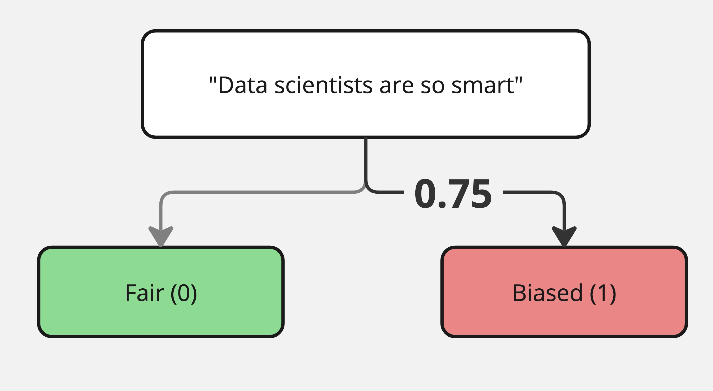
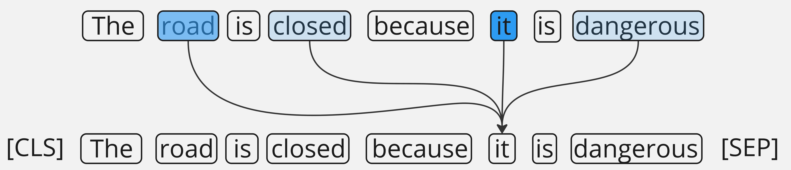
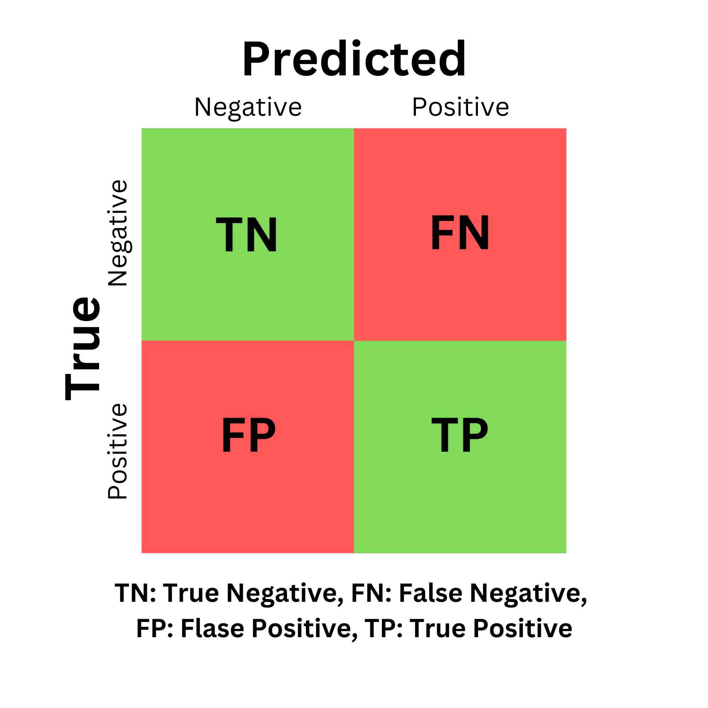

# Binary

### Overview of Task:

Binary classification is the foundation of many bias detection frameworks, and in this case refers to classifying an entire text sequence as "biased" or "unbiased."

This is typically implemented with an encoder-only model, such as [BERT](https://huggingface.co/docs/transformers/en/model\_doc/bert), to create encodings (i.e. contextual representations) that capture "the meaning" of a sentence, and can be passed to a classifier layer(s) with one output feature (for 0 to 1 probability of a single class: "Biased").

<figure><figcaption></figcaption></figure>

***

### 🤖 Models:&#x20;




One of the UnBIAS findings is that ternary classification (see [Multi-Class](multi-class.md)) is a stronger approach, but the binary classification model is just as good.


### UnBIAS Classifier

UnBIAS is a framework started in 2023 by Raza. et al at the Vector Institute, and a refresh of the technology proposed in Dbias.

:hugging: HF Space to [Test UnBIAS Classifier](https://huggingface.co/spaces/newsmediabias/UnBIAS)

**Base Model**: `bert-base-uncased` Dataset: [BEAD](https://huggingface.co/datasets/shainar/BEAD) (3.67M rows)

#### 🤗 Hugging Face Model



**📄 Research Paper**



#### Use UnBIAS Classifier:

```python
# pip install transformers
from transformers import AutoTokenizer, AutoModelForSequenceClassification

tokenizer = AutoTokenizer.from_pretrained("newsmediabias/UnBIAS-classification-bert")
model = AutoModelForSequenceClassification.from_pretrained("newsmediabias/UnBIAS-classification-bert")

classifier = pipeline("text-classification", model=model, tokenizer=tokenizer , device=0 if device.type == "cuda" else -1)
classifier("Anyone can excel at coding.")
```



### Dbias

Dbias proposed an architecture in 2022, for addressing news media bias, with a framework that utilized binary classification, [named-entity recognition](../ner/), bias masking, and word recommendation (Raza, et al.).

<figure><figcaption></figcaption></figure>

While reimplementations have made changes in approach, Dbias was a trailblazer, especially for binary classification (the first phase in the image above).

Base Model: `bert-base-uncased`, Dataset: [MBAD Dataset](https://aclanthology.org/2022.constraint-1.9.pdf)

#### 🤗Hugging Face Model



**📄 Research Paper**



### Use Dbias Bias Classification:

Dbias has a [PyPI package](https://pypi.org/project/Dbias/).

```python
# pip install Dbias
# pip install https://huggingface.co/d4data/en_pipeline/resolve/main/en_pipeline-any-py3-none-any.whl
from Dbias.bias_classification import *

# returns classification label for a given sentence fragment.
classifier("Tall people are so clumsy.")
```



This is running list of cool binary classification models we've seen and want to learn more about. If you find one that should be here, send it to us on [discord](https://discord.gg/Jn6TYxwRjy).


Fake/biased news binary classifier.



Passes the "looks good to me" test with flying colors. Also has a [quantized version](https://huggingface.co/protectai/distilroberta-bias-onnx) on hf.





### 💾 Datasets:



### **Bias Evaluation Across Domains (BEADs) Dataset**

3.67M rows | 2024

The BEADs corpus was gathered from the datasets: [MBIC](https://zenodo.org/records/4474336), [Hyperpartisan news](https://huggingface.co/datasets/SemEvalWorkshop/hyperpartisan\_news\_detection), [Toxic comment classification](https://www.kaggle.com/competitions/jigsaw-toxic-comment-classification-challenge), [Jigsaw Unintended Bias](https://www.kaggle.com/competitions/jigsaw-unintended-bias-in-toxicity-classification), [Age Bias](https://dataverse.harvard.edu/dataset.xhtml?persistentId=doi:10.7910/DVN/L4OAKN), [Multi-dimensional news (Ukraine)](https://zenodo.org/records/3885351#.ZF0KoxHMLtV), [Social biases](https://maartensap.com/social-bias-frames/).&#x20;

It was annotated by humans, then with semi-supervised learning, and finally human verified.

It's one of the largest and most up-to-date datasets for bias and toxicity classification, though it's currently private so you'll need to request access through HuggingFace.

**🤗HuggingFace Dataset**



**📑 Contents**

<table><thead><tr><th width="211">Fields</th><th>Description</th></tr></thead><tbody><tr><td><strong><code>text</code></strong></td><td>The sentence or sentence fragment.</td></tr><tr><td><strong><code>dimension</code></strong></td><td>Descriptive category of the text.</td></tr><tr><td><strong><code>biased_words</code></strong></td><td>A compilation of words regarded as biased.</td></tr><tr><td><strong><code>aspect</code></strong></td><td>Specific sub-topic within the main content.</td></tr><tr><td><strong><code>label</code></strong></td><td>Indicates the presence (True) or absence (False) of bias. The label is ternary - highly biased, slightly biased, and neutral.</td></tr><tr><td><strong><code>toxicity</code></strong></td><td>Indicates the presence (True) or absence (False) of toxicity.</td></tr><tr><td><strong><code>identity_mention</code></strong></td><td>Mention of any identity based on words match.</td></tr></tbody></table>

_While BEADs doesn't have a binary label for bias, the ternary labels (e.g. neutral, slightly biased, and highly biased) of the label field can categorized into biased (1), or unbiased (0). Additionally, the toxicity field contains binary labels._

**📄 Research Paper**



<figure><figcaption><p>Intended tasks for the BEADs dataset</p></figcaption></figure>



### Generalizations, Unfairness, and Stereotypes Dataset (Synthetic Corpus)

&#x20;37.5k rows | 2024

The GUS dataset (released in the [GUS-Net paper](https://arxiv.org/abs/2410.08388)), is an entirely synthetic dataset. It was generated by Mistral 7B, and later used for named-entity recognition. The results of GUS-Net showed that the synthetic corpus was effective across domains, and less noise than authentic datasets.

**🤗HuggingFace Dataset**



**📑 Contents**

<table><thead><tr><th width="211">Field</th><th>Description</th></tr></thead><tbody><tr><td><strong><code>biased_text</code></strong></td><td>The full text fragment where bias is detected.</td></tr><tr><td><strong><code>racial</code></strong></td><td>Binary label, presence (1) or absence (0) of racial bias.</td></tr><tr><td><strong><code>religious</code></strong></td><td>Binary label, presence (1) or absence (0) of religious bias.</td></tr><tr><td><strong><code>gender</code></strong></td><td>Binary label, presence (1) or absence (0) of gender bias.</td></tr><tr><td><strong><code>age</code></strong></td><td>Binary label, presence (1) or absence (0) of age bias.</td></tr><tr><td><strong><code>nationality</code></strong></td><td>Binary label, presence (1) or absence (0) of nationality bias.</td></tr><tr><td><strong><code>sexuality</code></strong></td><td>Binary label, presence (1) or absence (0) of sexuality bias.</td></tr><tr><td><strong><code>socioeconomic</code></strong></td><td>Binary label, presence (1) or absence (0) of socioeconomic bias.</td></tr><tr><td><strong><code>educational</code></strong></td><td>Binary label, presence (1) or absence (0) of educational bias.</td></tr><tr><td><strong><code>disability</code></strong></td><td>Binary label, presence (1) or absence (0) of disability bias.</td></tr><tr><td><strong><code>political</code></strong></td><td>Binary label, presence (1) or absence (0) of political bias.</td></tr><tr><td><strong><code>sentiment</code></strong></td><td>The sentiment given to Mistral 7B in the prompt.</td></tr><tr><td><strong><code>target_group</code></strong></td><td>The group Mistral7B was told to prompt.</td></tr><tr><td><strong><code>statement_type</code></strong></td><td>Type of bias prompted (e.g. "stereotypes," "discriminatory language," "false assumptions," "offensive language," "unfair generalizations").</td></tr></tbody></table>

_Mistral 7B was prompted to generate biased sentences, using the arguments in the table above. This means the entire thing should be biased. You may want to supplement this with a dataset of fair statements, and label all the sentences from this dataset with 1 (biased)._

**📄 Research Paper**



<figure><figcaption></figcaption></figure>

<figure><figcaption></figcaption></figure>



### Bias Annotations By Experts (BABE)

4.12k records | 2023

Human annotated, and all annotators must agree. In its paper, BABE showed great results with BERT for sequence classification of news articles. While smaller than some other datasets, the annotations are very reliable (highly recommended as an external dataset for model eval).

**🤗HuggingFace Dataset**



**📑 Contents**

<table><thead><tr><th width="187">Fields</th><th>Description</th></tr></thead><tbody><tr><td><strong><code>text</code></strong></td><td>The text fragment (few sentences or less).</td></tr><tr><td><strong><code>outlet</code></strong></td><td>The source of the text fragments.</td></tr><tr><td><strong><code>label</code></strong></td><td>0 or 1 (biased or unbiased).</td></tr><tr><td><strong><code>topic</code></strong></td><td>The subject of the text fragment.</td></tr><tr><td><strong><code>news_link</code></strong></td><td>URL to the original source.</td></tr><tr><td><strong><code>biased_words</code></strong></td><td>Full words contributing to bias, in a list.</td></tr><tr><td><strong><code>type</code></strong></td><td>Political sentiment (if applicable).</td></tr></tbody></table>

**📄 Research Paper**





Not added yet





Not added yet



Not added yet




***

### How it Works:


Train your own binary classification model: 📝 [Blog post](https://huggingface.co/blog/maximuspowers/bias-detection-in-text) - [💻 Training .ipynb](../../../resources/binary\_classification/bert\_bias\_binary\_training.ipynb)


<figure><figcaption></figcaption></figure>

1. BERT (and other encoder models) <mark style="background-color:yellow;">process an input sequence into a encoding sequence</mark> as shown in the figure below, where self-attention heads encode the contextual words' meaning into each token representation.&#x20;
2. These encodings are the foundation of many NLP tasks, and it's common (in BERT sequence classification) to then <mark style="background-color:yellow;">classify the CLS encoding</mark> into the desired classes (e.g. Biased, Neutral).&#x20;
   1. The CLS token (pooler\_output) is a built in pooling mechanism, but you can also use your own pooling mechanism (e.g. averaging all the representations for a mean-pooled representation).
3. `bert-base-uncased` has 768 output features (for each token) and we can <mark style="background-color:yellow;">pass the CLS token into a (768 -> 1) dense layer.</mark>
   1. This output logit of that classification head is activated (typically with a sigmoid or softmax function), for a probability that falls between 0-1.
4. A threshold is sometimes applied to the output (e.g. probability > 0.5 is "Biased").

Metrics:

When evaluating models' performance at binary classification, you should try to understand the way positive (biased), negative (neutral) fall into the categories: correct (true) predictions, and incorrect (false) predictions.

Your individual requirements will guide your interpretation (e.g. maybe you REALLY want to avoid false positives).

*   **Confusion Matrix**: Used to visualize the levels of correct and incorrect classifications made, the goal&#x20;

    <figure><figcaption></figcaption></figure>
* **Precision**: $$\frac{TP}{TP + FP}$$
* **Recall**: $$\frac{TP}{TP + FN}$$
* **F1 Score**: $$2 \times \frac{precision \times recall}{precision + recall}$$

***

